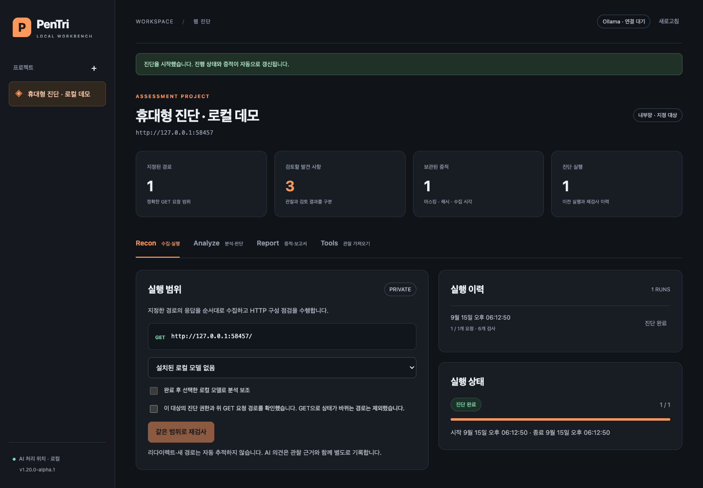

# PenTri Local

승인된 웹 진단의 **수집 → 분석 → 판단 → 증적·로그 → 보고서 → 이행 확인**을 연결하는 독립 로컬 워크벤치입니다. 내부망·외부망 대상을 명시적으로 지정하고, 설치된 Ollama 모델로 분석 의견을 받을 수 있습니다.

현재 버전은 **v1.20 alpha / M1**입니다. HTTP 구성 점검과 기록·재검사 흐름을 구현했습니다. 웹 취약점 전체의 자동 발견·확정, 인증 기반 능동 진단, 네이티브 exe 설치 프로그램은 아직 구현하지 않았습니다. 기존 v1.10의 모든 도구를 포함하지도 않습니다.



## 실행 형태

| 형태 | 현재 제공 |
| --- | --- |
| Windows / Mac PC | Node 서버 + 브라우저 UI, 더블클릭 런처 |
| 휴대 미니PC / Linux 서버 | 같은 코어 실행, 노트북에서 SSH 터널로 UI 접속 |
| 런타임 포함 휴대용 배포 | `npm run package:portable`; 빌드한 OS·CPU용 Node 포함 폴더 |
| Chrome 확장 | 선택 DOM 수집기. 독립 앱 실행에 필요하지 않음 |
| 단일 exe / 앱 번들 | 후속 단계. 현재 런처 배포본과 구별 |

## 바로 실행

Node.js **24.14 이상 24.x**가 필요합니다. 앱 실행에 `npm install`이나 외부 npm 패키지가 필요하지 않습니다.

```sh
npm start
```

브라우저에서 **http://127.0.0.1:8787**을 엽니다. `localhost` 대신 표시된 주소를 사용하세요. 브라우저도 함께 열려면 `npm run desktop`, Windows에서는 `Start-PenTri.cmd`, Mac에서는 `Start-PenTri.command`를 실행합니다. 터미널을 유지하고 종료할 때 Ctrl+C를 누릅니다.

기본 진단 자료 저장 위치는 `.pentri/pentri.sqlite`입니다. 설치·삭제·오프라인 운영과 환경 변수는 [운영 가이드](docs/operations.md)를 참고하세요.

## 로컬 예제로 검증

별도 터미널에서 `npm run demo`를 실행합니다. UI에서 프로젝트를 만들고 다음 범위를 입력합니다.

```text
origin: http://127.0.0.1:9080
networkPolicy: private
paths:
/
/login
```

1. Recon: 정확한 요청 경로를 확인하고 실행합니다.
2. Analyze: CSP, 프레임 제한, nosniff, 쿠키 속성 등의 관찰과 증적을 검토합니다. Ollama가 없어도 진단과 보고서는 동작합니다.
3. 판단 근거를 남기고 Report에서 HTML/JSON을 내려받습니다.
4. 데모를 종료하고 `DEMO_FIXED=1 npm run demo`로 다시 실행합니다. Windows PowerShell에서는 `$env:DEMO_FIXED='1'; npm run demo`를 사용합니다.
5. 같은 프로젝트를 재검사합니다. `not_observed`는 이번 규칙이 통과한 상태이며 검토자의 `fixed` 판단과 구분됩니다.

## Ollama

모델은 사용자가 미리 설치합니다. PenTri가 모델을 다운로드하거나 cloud 모델로 전환하지 않습니다. 로컬 실행 시에도 Ollama의 cloud 기능을 꺼야 합니다.

```sh
OLLAMA_NO_CLOUD=1 ollama serve
```

Windows PowerShell: `$env:OLLAMA_NO_CLOUD='1'; ollama serve`. 이미 Ollama 앱이 실행 중이면 해당 서버가 이 설정을 적용하도록 종료·재시작해야 합니다. 앱의 새로고침을 누른 뒤 로컬 모델을 선택하세요. [Ollama의 공식 cloud 비활성화 안내](https://docs.ollama.com/faq)를 함께 확인하세요.

AI에는 정규화된 규칙 관찰만 전달합니다. 대상 URL·응답 본문·쿠키·브라우저 수집 JSON은 전달하지 않습니다. 모델 출력은 스키마와 관찰 ID를 검증한 의견으로 저장되며, 요청 실행이나 판단 상태 변경 권한은 없습니다. 데이터 전송 경계와 한계는 [안전 설계](docs/security.md)에 설명했습니다.

## 저장소 구성

```text
src/         네트워크·규칙·Ollama·저장·실행·API·보고서
web/         독립 앱 UI
extension/   선택 DOM 관찰 수집기
tests/       양성/음성 fixture 및 회귀 테스트
scripts/     데모·런처·검증·휴대용 패키징
docs/        요구사항·원본 분석·설계·운영·검증 기록
```

- [개발 계획과 단계별 완료 조건](docs/implementation-plan.md)
- [첨부 v1.10 정적 분석](docs/legacy-audit.md)
- [독립 설계 검토](docs/design-review.md)
- [실제 검증 결과와 남은 작업](docs/validation.md)
- [변경 기록](CHANGELOG.md), [출처·라이선스 상태](THIRD_PARTY_NOTICES.md)

```sh
npm run check
npm test
npm run package:portable
```

GitHub Actions는 Windows/macOS/Linux 테스트와 OS별 휴대용 폴더 생성을 수행합니다. 실제 통과 여부는 해당 실행 결과로 확인해야 합니다. Chrome 웹 스토어 등록은 이번 단계에서 보류했습니다. 기존 `docs/privacy/`는 이전 배포 정책이며 새 앱의 배포 승인 자료가 아닙니다.

휴대용 패키징에는 공식 Node 바이너리와 LICENSE가 필요합니다. Homebrew 빌드는 독립 배포용으로 사용할 수 없으므로 [PENTRI_NODE_DIR 설정](docs/operations.md)을 확인하세요.
