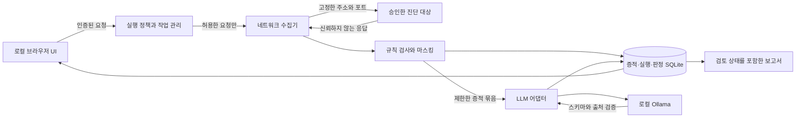

# PenTri 로컬 자동화 독립 설계 검토

검토일: 2026-09-11. 상태: 개발 방향 검토안. 구현 완료·보안 검증 완료·운영 승인 기록을 뜻하지 않는다.

검토 입력은 [기존 요구사항](pentri-v1.20-requirements.md), 현재 사용자 요청과 [실행 계획](implementation-plan.md)이다. 기존 문서의 확장 프로그램 우선 순서, v1.20 범위, 배포 보류 문구는 당시 기록으로 읽었다. 현재 요청은 **Ollama를 사용하는 독립 프로그램의 기획·제작·테스트·개선**을 우선하며 후속 답변에서 **내부망·외부망 진단, Windows 중심 실행과 Mac 지원**을 확인했다. 진단 대상의 망과 AI 추론 위치는 독립적으로 다루며 외부망 진단에서도 로컬 추론을 유지한다. 아래 선택과 수치는 이 요청을 구체화한 설계 제안이며, 사용자가 이미 확정한 세부 설정으로 표시하지 않는다.

## 1. 판단

**로컬 서비스 + 별도 브라우저 탭 UI + 제한된 수집 엔진 + SQLite 기록 + Ollama 분석 보조**로 첫 구현을 시작할 수 있다. 브라우저 확장 수집기는 이후 같은 데이터 계약을 사용하는 어댑터로 추가한다. 기존 UI를 그대로 확대하기보다 대상·실행·증적·판정 수명을 서버에서 관리하는 편이 장기 목표에 적합하다.

완전 자동화는 모든 취약점에 대한 무오류 판정의 약속으로 정의하지 않는다. 승인된 범위에서 기계적으로 반복할 수 있는 검사, 근거 연결, 검토 상태 관리, 보고서 초안, 동일 조건 재검증을 자동화하고 각 단계의 실패·미확인 상태를 남기는 것이 검증 가능한 제품 목표다. 인증 우회·업무 로직·권한 관계처럼 추가 시나리오와 운영 판단이 필요한 검사는 검토 작업으로 남긴다.

첫 버전에서 LLM은 이미 수집한 증적에 대한 설명·우선순위·조치방안 초안을 작성한다. 실행할 URL, HTTP 메서드, 범위, 예산, 셸 명령, 최종 판정 권한을 부여하지 않는다. 향후 자동 실행을 늘릴 때도 실행 권한은 모델 외부 정책 엔진에서 결정한다. 이는 과도한 도구 권한을 줄여야 한다는 [OWASP Excessive Agency](https://genai.owasp.org/llmrisk/llm062025-excessive-agency/) 방향을 적용한 설계다.

## 2. 신뢰 경계와 책임

| 구성 요소 | 책임 | 부여하지 않는 권한 |
| --- | --- | --- |
| 브라우저 UI | 대상·경로·예산 표시, 실행·정지, 근거 검토, 보고서 다운로드 | 임의 파일 경로, Ollama URL, 프로세스 실행 전달 |
| 정책 엔진 | 실행 전 범위 확정, 요청별 재검사, 정지·예산 강제 | LLM 출력으로 설정 변경 |
| 네트워크 수집기 | 승인 URL에 제한된 GET, 응답 상한, 증적 메타데이터 | 자동 리다이렉트, 페이지 JS 실행, 인증정보 자동 수집 |
| 규칙 엔진 | 관찰 사실·후보 분리, 정확한 근거 위치, 검사 버전 | 제품명 추정만으로 CVE 확정 |
| LLM 어댑터 | 마스킹한 증적의 설명, 고정 스키마, 알려진 ID 검증 | 도구 호출, 브라우징, 추가 대상 요청, 파일·셸 접근 |
| 저장·보고서 | 실행과 증적 연결, 판정 변경 이력, 재검증 비교 | 관찰 누락이나 LLM 실패를 정상 판정으로 치환 |

Node 24 내장 HTTP·crypto·test·SQLite 중심 구현은 배포 의존성을 줄일 수 있다. 다만 [Node 24 SQLite 문서](https://nodejs.org/docs/latest-v24.x/api/sqlite.html)는 v24.15.0부터 SQLite 모듈을 Release candidate로 표시하며 `DatabaseSync`는 동기 실행이다. 현재 개발 환경의 Node 24.14.1에서는 실험적 API다. 지원할 Node 하한과 실제 검증 버전을 기록하고 저장소 계층을 분리한다. 큰 본문 파싱·긴 DB 트랜잭션이 정지 API를 막지 않도록 응답·조회·쓰기 크기를 제한한다. 기능 규모가 커질 때 worker 또는 별도 작업 프로세스로 이동할 수 있어야 한다. OS별 임시 경로·파일 권한·종료 시그널·프로세스 시작 방식을 검증하며 macOS에서 실행한 결과를 Windows 검증으로 표시하지 않는다.

## 3. 개발 단계에서 막아야 할 설계 결함

### 범위와 HTTP 요청

사설 IP라는 이유만으로 전체 내부망을 허용하면 이 도구가 내부 서비스 접근 프록시가 된다. 범위는 정규화한 **scheme + hostname + port**, 사용할 IP, 경로 목록, 메서드, 실행 예산의 스냅샷이다. hostname 접미사 비교나 URL 문자열 시작 부분 비교를 사용하지 않는다. URL userinfo, HTTP(S) 이외 scheme, 모호한 IP 표현은 거부한다.

DNS 검증 뒤 일반 클라이언트가 다시 조회하면 검사와 연결 사이에 주소가 바뀔 수 있다. A/AAAA 응답을 모두 검사하고 승인한 IP를 실제 소켓 연결에 사용한다. HTTPS는 원래 hostname을 SNI·인증서 검증에 유지한다. IP 변경 시 새 범위 검토로 돌리고 같은 실행이 임의로 새 주소를 채택하지 않는다. 연결 재시도에서도 정책을 재사용한다. 자동 리다이렉트는 끄고 3xx 및 목적지만 증적에 기록한다. 이 통제는 [OWASP SSRF Prevention](https://cheatsheetseries.owasp.org/cheatsheets/Server_Side_Request_Forgery_Prevention_Cheat_Sheet.html)의 allowlist·주소 검사·리다이렉트 방지 원칙을 진단 도구에 적용한 것이다.

프로젝트의 `networkPolicy`는 기본 `private`와 명시적으로 선택하는 `public`을 둔다. 기본 정책은 명시적으로 승인한 RFC1918 IPv4와 IPv6 ULA 범위 내 주소를 허용한다. `public`은 정확히 승인한 origin에 대해 정상 공인 주소를 추가 허용하는 의미다. 루프백은 로컬 실습용 대상 origin을 직접 지정한 경우에만 허용한다. 두 정책 모두 link-local, 메타데이터 주소, multicast, unspecified·reserved 주소를 대상에서 차단한다. **PenTri 자체 서비스와 Ollama 서비스는 public 정책·루프백 실습 허용 여부와 무관하게 대상에서 제외**한다. IPv4-mapped IPv6·동일 IP 별칭·다른 hostname의 동일 서비스도 같은 기준으로 판단한다. public 전환이 origin·경로·IP pinning을 해제하는 옵션이 되어서는 안 된다. 사내 인증서는 CA를 명시적으로 신뢰하도록 구성하고 인증서 검증을 전역 해제하지 않는다.

GET만 보내는 검사는 요청을 생성하므로 엄밀하게 네트워크 수동 관찰만 하는 모드는 아니다. `/logout`, 상태 변경 쿼리, 비정상적으로 큰 dump 다운로드처럼 GET에도 부작용이 있다. 첫 구현은 사용자가 화면에서 확인한 작은 경로 목록만 요청하고 크롤러·폼 제출·무작위 경로 사전·쿼리 변형·자동 source map 다운로드를 추가하지 않는다. 자동 발견 링크는 후보 목록으로만 남긴다. 경로 denylist는 보조 통제이며 임의 GET의 무해함을 보장하지 않는다.

초기 예산 제안은 동시 요청 1개, 총 20개 이하, 초당 최대 1개, 요청당 10초, 전체 120초, 응답당 1 MiB다. 실제 기본값과 하드 상한은 구현·UI·테스트에서 일치시킨다. 상한은 전송·파싱 단계에 적용하고 압축 해제 상한도 고려한다. 처음에는 `Accept-Encoding: identity`를 요청하고 지원하지 않는 압축 응답을 분석하지 않는 방식도 가능하다. 예산은 UI 표시에 그치지 않고 서버에서 검사한다. HTML 파싱 중 외부 리소스나 DNS를 자동 조회하지 않는다.

### 로컬 UI와 CSRF

127.0.0.1 바인딩만으로 브라우저를 통한 공격이 차단되지는 않는다. 악성 웹페이지의 localhost API 호출과 DNS rebinding을 고려해 정확한 Host 검사, 동일 origin 요청 검사, 예측 불가능한 실행 세션 토큰을 함께 둔다. API가 쿠키를 사용한다면 CSRF 토큰과 SameSite 설정을 적용한다. 상태 변경은 GET으로 처리하지 않으며 JSON과 인증 헤더가 없는 단순 폼 요청을 거부한다. CORS 허용 헤더가 없다는 사실만으로 CSRF 방어 완료로 판정하지 않는다. 관련 방어 계층은 [OWASP CSRF Prevention](https://cheatsheetseries.owasp.org/cheatsheets/Cross-Site_Request_Forgery_Prevention_Cheat_Sheet.html)을 참고한다.

세션 토큰은 API 응답·실행 로그·보고서·쿼리 문자열에 남기지 않는다. 부트스트랩에 URL fragment를 사용한다면 읽은 뒤 주소에서 제거하고 외부 리소스를 로드하지 않는다. 다른 origin, `Origin: null`, 인증 없는 API 요청, 위조한 Host, 임의 OPTIONS 요청의 결과를 테스트한다. UI와 HTML 보고서는 대상 HTML·LLM Markdown을 신뢰하지 않고 텍스트로 출력하거나 제한된 렌더러로 처리한다. CSP와 외부 이미지 차단으로 보고서를 열었을 때의 외부 통신도 줄인다.

### Prompt injection과 모델 출력

HTML·JS 주석·응답 헤더·문서·증적에 들어 있는 지시는 검사 대상 데이터다. 역할 메시지로 승격하거나 도구 지시로 실행하지 않는다. 모델에는 증적 ID, 규칙 관찰, 제한된 발췌문만 전달하고 대상별 대화·검색 인덱스를 분리한다. 방어 프롬프트 하나로 해결하려 하지 않는다. 간접 입력이 모델 동작을 바꿀 수 있다는 [OWASP Prompt Injection](https://genai.owasp.org/llmrisk/llm01-prompt-injection/) 위험을 전제로 실행 권한을 분리한다.

Ollama의 `format`에 JSON Schema를 전달하고 출력은 서버에서 다시 검증한다. [Ollama Structured Outputs](https://docs.ollama.com/capabilities/structured-outputs)는 스키마 입력과 응답 검증을 설명한다. PenTri의 추가 요구는 `additionalProperties: false`, enum·길이·배열 개수 제한, 알려진 finding/evidence ID만 허용, URL·명령 필드 미지원이다. JSON 문법이 맞는 것과 주장이 맞는 것은 별도다. 인용한 증적에 없는 내용, 출처 ID 조작, 상태 확정 시도는 분석 실패 또는 검토 필요로 저장한다.

모델이 제안한 개선방안은 자동 실행하지 않는다. `confidence`를 모델이 출력하더라도 통계적으로 보정된 성공 확률처럼 보이지 않게 한다. 출력 없음·시간 초과·형식 오류는 규칙 검사와 보고서 생성을 중단시키지 않는다. 실패 사유와 사용한 모델·프롬프트 버전·증적 ID는 남긴다.

### 외부 유출과 로컬 Ollama

Ollama가 로컬 주소에 있다는 사실만으로 추론이 로컬에서 끝나는 것은 확인되지 않는다. 공식 FAQ는 로컬 전용 설정으로 `OLLAMA_NO_CLOUD=1` 또는 `disable_ollama_cloud: true`와 재시작을 안내한다. 설정 후 로그도 확인한다. [Ollama FAQ](https://docs.ollama.com/faq)

제품은 사전 설치한 모델 allowlist를 사용하고 cloud 모델·원격 API·웹 검색·자동 모델 pull을 실행 경로에 제공하지 않는다. 서버 설정 파일에서만 Ollama 주소를 지정하고 첫 단계는 loopback endpoint로 제한한다. 모델 tag, digest, 실행 환경을 기록한다. 내부망 인증은 앱 설정만으로 증명할 수 없으므로 실제 운영 전에는 Node·Ollama의 외부 egress 차단 상태와 네트워크 관찰 결과로 검증한다. 설치·모델 반입 단계와 진단 실행 단계를 구분한다.

NVD 조회·외부 폰트·CDN·원격 오류 수집·자동 업데이트를 진단 흐름에 섞지 않는다. 후속 CVE 기능은 출처·가져온 날짜를 포함한 오프라인 데이터 반입부터 설계한다. API key·Cookie·Set-Cookie 값·Authorization·URL query의 비밀값·본문의 알려진 비밀 패턴은 LLM 전송·기본 저장·내보내기 전에 마스킹한다. 마스킹이 모든 개인정보를 찾는다는 보장은 하지 않는다. 필요한 최소 구간만 전달하고 검토 전 원문 자동 반출은 지원하지 않는다.

## 4. 증적·판정·재검증 계약

| 데이터 | 최소 기록 |
| --- | --- |
| 실행 | run ID, scope snapshot/hash, 사용자 범위 확인 시각, 정책·검사 버전, 시작/종료, 정지/실패 이유, 실제 요청·바이트 수 |
| 요청 증적 | evidence ID, run ID, 마스킹한 URL, 요청 메서드, 요청·응답 시각, 연결 IP, 상태·헤더, 마스킹한 발췌문, 수집/절단/마스킹 정보 |
| 관찰·후보 | finding ID, 규칙 ID/버전, evidence ID, 관찰 내용, 영향 가설, 검증 상태, 심각도 근거, 검토자 기록 |
| LLM 보조 | 입력 증적 ID, 모델 tag/digest, 프롬프트 버전, 스키마 버전, 설명·조치 초안, 검증 오류 |
| 재검증 | 원 finding ID, 이전 run ID, 새 run ID, 동일 규칙·조건 여부, 이전/현재 관찰, 접근성, 판정과 검토 기록 |
| 보고서 | 생성 시각, 포함한 실행·증적·판정 버전, 점검 범위·누락, AI 작성 부분, 미확인 사항, 개선방안과 재검증 결과 |

관찰은 응답에서 확인한 사실, 후보는 추가 검증이 필요한 영향 가설이다. `confirmed`, `rejected`, `needs-review`, `not-observed`, `inconclusive`와 같은 상태를 명시하고 단순 헤더 누락·제품 흔적·HTTP 200을 전체 취약성 확정으로 승격하지 않는다. 정확히 지정한 검사 조건의 통과와 시스템 전체 안전성을 구별한다. 공통 200 오류 페이지, 로그인 화면, WAF 차단, timeout, 절단된 응답은 그 상태로 남긴다.

재검증은 같은 주소·권한·규칙 조건에서 새 증적을 만들고 이전 발견과 연결한다. 연결 실패·401·403·빈 응답·경로 변경을 개선 완료로 처리하지 않는다. 조건이 달라졌으면 비교 불가 사유를 표시한다. 확인 가능한 규칙의 재검사 통과는 자동으로 기록할 수 있지만 최종 이행 완료 판정에는 확인 조건과 검토 상태를 남긴다.

첫 구현은 마스킹한 텍스트 증적을 기본 저장하고 원본 응답·캡처 원본 보관은 별도 정책을 가진 후속 기능으로 둔다. 저장한 증적의 SHA-256은 이후 변경 탐지에 쓸 수 있으나 단독으로 수집 시점의 진실성이나 강한 위변조 방지를 증명하지 않는다. 수집 원문 hash와 마스킹 후 hash를 혼동하지 않는다. DB·보고서·실습 산출물은 gitignore로 제외하고 소유자만 접근할 수 있는 저장 디렉터리를 사용한다. SQL은 bound parameter로 작성한다.

보존 제안은 기본 30일이며 사용자가 기간을 줄이거나 프로젝트를 삭제할 수 있게 한다. 이를 첫 단계에서 구현하지 못하면 자동 삭제가 없다는 사실과 삭제 절차를 명확히 적는다. DB 삭제는 WAL·백업·내보낸 보고서까지 포괄하는 삭제 정책과 연결한다. 일반 SQLite가 저장 파일을 자동 암호화한다고 설명하지 않는다. 초기 운영은 암호화된 호스트 볼륨을 전제로 하고 앱 암호화·키 관리가 필요한 환경은 이후 보안 설계 범위로 남긴다.

## 5. 첫 milestone의 종료 기준

첫 milestone은 **로컬 실습 서버에 대한 제한된 진단 → 증적 → Ollama 보조 → 보고서 → 재검증**의 수직 흐름이다. 범용 크롤러·공격 페이로드·인증 세션 자동 조작·스크린샷 편집·스토어 등록을 함께 넣지 않는다.

| 확인 항목 | 통과 증거 |
| --- | --- |
| 실행 형태 | Node 실행 후 별도 탭 UI가 열리고 탭을 닫았다 열어도 실행·결과가 유지됨 |
| 범위 강제 | 명시 URL·IP·포트·경로 이외 대상은 실제 연결 전에 거부되고 거부 로그가 남음 |
| 네트워크 경계 | private에서 공인 IP 거부, public에서 정확히 허용한 공인 IP 허용, DNS 변경·혼합 A/AAAA·IPv4-mapped 주소 정책 검사, 외부 redirect·메타데이터·자체 API·Ollama 대상 차단 |
| 예산·정지 | timeout·큰 응답·느린 응답에서 상한을 지키고 정지 후 새 요청이 시작되지 않음; 진행 중 연결·LLM 호출에 취소 전달 |
| 로컬 API | 무인증·타 origin·위조 Host·단순 폼 요청이 실행·증적 조회를 못 함 |
| 판정 정확성 | 취약 단서·정상 응답·로그인 화면·soft 404·차단·오류 fixture에 기대한 상태가 나오고 근거 없는 확정이 없음 |
| 모델 권한 | 프롬프트 인젝션 fixture의 추가 URL 요청·명령 실행·상태 변경 지시가 실행되지 않음 |
| 모델 실패 | 잘못된 JSON, 과대 출력, 알 수 없는 ID, 시간 초과에서도 규칙 결과·실패 기록·보고서가 유지됨 |
| 로컬 추론 | mock API 계약 테스트와 실제 설치 모델 smoke test를 구분; 실제 모델이 없으면 통합 완료로 표시하지 않음 |
| 데이터 | 재시작 후 SQLite 결과 유지, 마스킹한 비밀값만 표시·내보내기, 보고서 항목과 원 finding ID 일치 |
| 재검증 | 실습 서버의 설정을 바꿔 개선 전후 관찰을 연결하고 서버 중단은 판정 불가로 기록 |
| 저장소 | 설치·실행·테스트·한계·데이터 정책·원본 출처·라이선스 미확인 항목이 문서로 정리됨 |

이 체크리스트는 목표 수용 기준이다. 현재 테스트 결과를 대체하지 않는다. 최종 검증 문서에는 각 항목을 통과·실패·미실행으로 표시하고 명령·환경·테스트 근거를 연결한다. 자동 테스트에서 쓰는 네트워크 대상은 로컬 fixture로 한정한다.

## 6. 전체 목표까지의 단계

| 단계 | 결과물 | 다음 단계로 넘어갈 근거 |
| --- | --- | --- |
| M0 분석·설계 | 원본 ZIP 파일 목록·해시, 기존 기능/결함/재사용 판단, 데이터 계약, 위협 모델, 첫 범위 | 출처가 구분되고 위험 통제를 테스트 가능한 조건으로 표현함 |
| M1 로컬 수직 구현 | 제한 GET 수집, 규칙 판정, 증적·로그·보고서·재검증, Ollama 어댑터, 실습 서버 | 위 첫 milestone 수용 기준의 실측 결과와 미실행 항목 공개 |
| M2 분석 확대·품질 | 전문가 라벨 fixture, false positive/negative 측정, 모델 비교, 오프라인 CVE 반입, 인증 세션·정밀 DOM/JS 분석 | 목표 환경의 실제 모델 성능·자원 사용·egress 검증, 탭·문서 증적 혼합 방지와 최소 권한 검증 |
| M3 승인한 능동 검사 | 검사별 사전 조건·허용 행위·부하·복구·정지 정의, 인증 역할별 시나리오 | 격리 실습 환경에서 검사별 정확도와 부작용 검증, 범위 밖 실행 차단 |
| M4 전체 진단 업무 | 프로젝트·검토·보고서 템플릿·개선 과제·이행 확인·일정별 반복·증적 이미지 | 대상별 누락과 미확인을 포함한 작업 전체 추적, 변경 시 재승인/재검증 정책, 보존·암호화·복구 검증 |
| M5 배포 확대 | Windows/macOS 패키지, 필요시 스토어 자료·상용 LLM 어댑터 | OS별 실측 테스트, 배포 서명, 라이선스·모델 반입 조건·키 보관·전송 정책·스토어 권한과 실제 동작의 일치 |

선택적 MV3 JSON 수집기는 M1에서 최소 계약을 검증하고, 정밀 브라우저 관찰은 M2에서 확대할 수 있다. 확장 수집과 이후 상용 LLM 연결은 독립 기능으로 설계해 로컬 버전의 네트워크 정책을 약화시키지 않는다. 스토어 등록은 제품 실행에 필수 의존성으로 두지 않는다. 기존 개인정보처리방침은 실제 데이터 저장·전송·삭제 동작이 확정된 후 그에 맞게 갱신한다.

## 7. 개발을 시작할 근거와 남은 확인

사용자는 로컬 버전의 기획·제작·테스트·개선을 요청했다. 이 요청과 현재 저장소를 근거로 로컬 fixture, 정책 엔진, 데이터 모델, UI, Ollama 계약 테스트 개발을 시작할 수 있다. 일반적인 구현 선택을 다시 승인받을 필요는 없다. 이후 진단 대상에 대한 범위 확인은 제품 기능으로 구현하며 지금의 개발 착수 승인과 혼동하지 않는다.

개발 전 확보할 최소 근거는 원본 아카이브 분석, 보존할 기능 목록, 위 신뢰 경계, M1 검사 종류, 실패 상태, 자동 테스트할 수용 기준이다. 특정 실제 내부망 주소·접근 권한·운영 허용 시간·하드웨어·설치 모델 정보는 제공된 기록에서 확인되지 않았다. 이 정보 없이도 로컬 실습과 mock 테스트는 진행 가능하다. 실제 대상 파일럿과 실제 모델 품질 측정은 해당 환경이 준비된 뒤 결과를 별도로 남긴다.

우선 해결할 설계 결함은 ① 사설 IP 전체 허용 ② DNS 검증 후 재조회 ③ GET의 무조건적 무해 가정 ④ localhost 인증·CSRF 부재 ⑤ LLM 출력에 실행/확정 권한 부여 ⑥ Ollama 로컬 주소만으로 외부 전송 차단 주장 ⑦ 통신 실패를 개선 완료로 판정하는 처리다. 이 항목을 코드와 회귀 테스트에서 먼저 닫는 조건으로 제안 방향을 채택한다.
